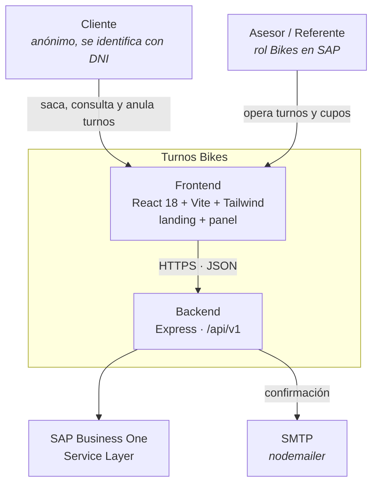
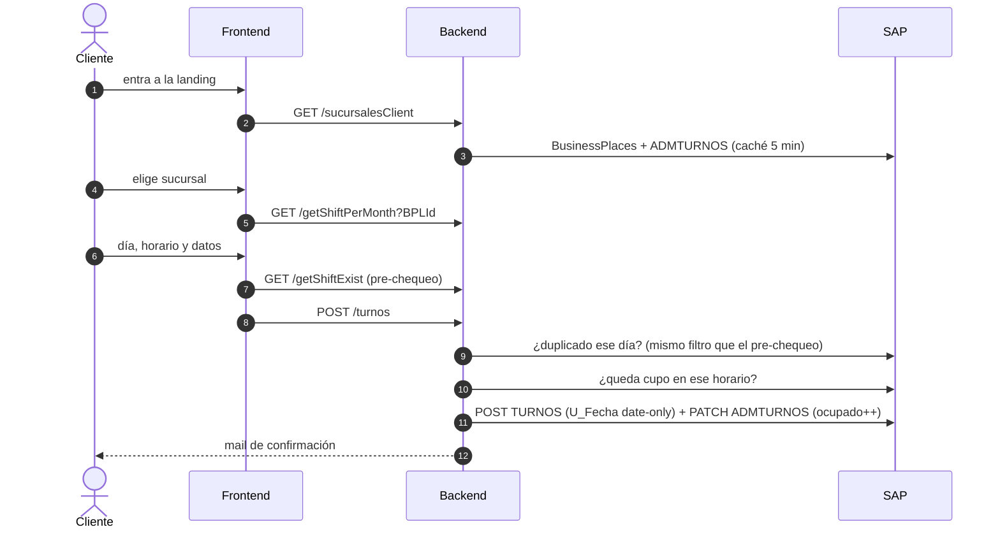

# Arquitectura — Turnos Bikes

Sistema de turnos de service de bicicletas de Yuhmak. Son dos repos:

- `Turnos-Bikes-Frontend` (este): SPA con la landing pública y el panel privado.
- `turnos-bikes-backend` (carpeta hermana): API Express sin base de datos.

El documento vive acá porque describe los dos lados, y tener dos copias garantiza que una quede vieja.

- Actualizado: 29/09/2026
- Decisiones: [`docs/adr/`](./adr/)
- Sistema hermano: Turnos Service (motos), con la misma arquitectura. Buena parte de lo que está acá se portó de ahí.

---

## 1. Contexto

**La única fuente de verdad es SAP Business One.** El backend es un proxy que traduce HTTP a OData contra el Service Layer. No persiste nada.

| | Hace | No hace |
|---|---|---|
| **Frontend** | Presentación, validación de formularios (react-hook-form), filtros del panel en la URL, export CSV | Hablar directo con SAP |
| **Backend** | Traducir a OData, login contra SAP, validar duplicados y cupo, mandar el mail de confirmación | Persistir datos |
| **SAP B1** | Todos los datos: turnos, cupos, clientes, sucursales, usuarios y roles | — |

**Actores**

- **Cliente:** anónimo. Saca un turno y consulta o anula los que ya tiene, siempre con el DNI.
- **Asesor / Referente:** entra al panel con su usuario de SAP. Necesita el rol `Bikes` y una posición Cajero, Vendedor, Referente o IT (ver `src/routes.js`).
  - **Panel de turnos:** gestiona los turnos del día.
  - **Calendario de cupos:** carga cuántas recepciones entran por horario.
  - **Cobertura:** muestra hasta cuándo llega el calendario de cada sucursal.

## 2. Datos en SAP

| UDT | Qué guarda | Campos que importan |
|---|---|---|
| `TURNOS` | Un turno de un cliente | `U_Fecha`, `U_StartTime`, `U_dni`, `U_BPLId`, `U_BPLName`, `U_State`, `U_problemTyp`/`U_ProSubType`, `U_descrption`, `U_TipoOrigen` |
| `ADMTURNOS` | La capacidad de un día en una sucursal | `U_Fecha`, `U_BPLId`, `U_HorarioRecep` |

Hay tres particularidades del dato que ya causaron bugs:

1. **`TURNOS.U_Fecha` tiene formatos mezclados y OData lo compara como string.** Conviven `2026-09-30` y `2026-09-30T00:00:00Z`. Por eso los filtros usan rangos `ge día and lt día+1`, nunca `eq` ni `le` contra el último día. Ver [ADR-0001](./adr/0001-rango-de-fechas-con-formatos-mezclados.md).
2. **`U_HorarioRecep` es JSON dentro de un campo de texto.** Cada día tiene un array de `{hs, cantrecep, ocupado, habilitad}`. Algunos registros vienen con comillas simples. Se parsea con `parsearHorarios()` (`services/cuposService.mjs`), y un día con JSON roto se saltea en lugar de tirar abajo todo el listado.
3. **TURNOS puede tener turnos de motos del mismo DNI.** Todo lo que el cliente consulta o anula se filtra por las sucursales de bikes. Ver [ADR-0003](./adr/0003-consulta-y-anulacion-por-dni.md).

**Estados de un turno:** `Pendiente` (también cuando viene `null`), `Atendido` y `Anulado`.

- Anular libera el cupo en ADMTURNOS: `liberarCupo()` descuenta `ocupado` sin dejarlo nunca en negativo.
- Volver a pendiente no vuelve a ocupar el cupo. Por eso un anulado no se deshace desde el panel. Ver [ADR-0004](./adr/0004-anulados-ocultos-y-sin-deshacer.md).

## 3. API

Todo cuelga de `/api/v1`. Las rutas marcadas con 🔓 se usan desde la landing, sin sesión, con el usuario maestro de SAP (`NODE_MASTER_*`).

| Endpoint | Uso |
|---|---|
| `POST /login`, `/loginAgain`, `/logout` | Sesión SAP del asesor |
| 🔓 `GET /sucursalesClient` | Sucursales que la web ofrece (derivadas de SAP, [ADR-0002](./adr/0002-sucursales-derivadas-de-sap.md)) |
| 🔓 `GET /getShiftPerMonth?BPLId` | Días y horarios con cupo, de mañana a +60 días |
| 🔓 `GET /getShiftExist?U_dni&U_Fecha` | Pre-chequeo de duplicado. Devuelve solo `{exists}` |
| 🔓 `POST /turnos` | Crear el turno: valida duplicado y cupo, da de alta al cliente si no existe y manda el mail |
| 🔓 `GET /misTurnos?U_dni` | Turnos vigentes de un DNI, con proyección mínima |
| 🔓 `PATCH /misTurnos/anular` | El cliente anula su turno |
| 🔓 `GET /searchCustomerMotorbike` | Heredado. Devuelve datos completos del cliente (ver §5) |
| `GET /getShiftMonth` | Turnos de un mes y sucursal (panel) |
| `GET /getShiftsLastMonth` | Calendario de cupos de un mes (panel) |
| `POST /createShiftList`, `PATCH /patchShiftList` | Cargar y editar el calendario de cupos |
| `PATCH /patchShiftStatus/:DocEntry` | Cambiar el estado de un turno (y liberar el cupo si se anula) |
| `GET /coberturaSucursales` | Cobertura del calendario por sucursal |
| `GET /sucursales`, `GET /usuarioPtoEmision`, `GET /users`, … | Soporte del login y del panel |

## 4. El camino de un turno

El pre-chequeo y la validación del backend usan el **mismo** filtro: `buildTurnoDelDiaFilter()`, en `getShiftExist.mjs`. Si divergen, el formulario deja avanzar y el turno recién falla al crearse.

## 5. Seguridad

| Punto | Estado |
|---|---|
| Rutas 🔓 que interpolan datos en OData | DNI, fecha y BPLId se validan antes (`esDniValido`, `esFechaValida`, `/^\d+$/`) |
| `/getShiftExist` | Antes devolvía los registros completos de TURNOS. Ahora solo devuelve `{exists}` |
| `/misTurnos` y `/misTurnos/anular` | **Pendiente de revisión del área de seguridad.** Solo con el DNI se ven y se anulan turnos. Ver [ADR-0003](./adr/0003-consulta-y-anulacion-por-dni.md) |
| `/searchCustomerMotorbike` | **Pendiente de revisión.** Devuelve datos completos del cliente sin sesión. Viene de antes y no se tocó |
| Rate limiting en rutas 🔓 | No hay |
| Logs | Los errores de axios se loguean con `error.message`, porque el dump completo incluye el body del Login con las credenciales maestras. Queda algún `console.log(error)` viejo por revisar |
| Front → back | El interceptor manda `document.cookie` completo como `Authorization`. Viene de antes |

Cualquier cambio en estos puntos se consulta con el área de seguridad antes de ir a producción.

## 6. Frontend

- **Rutas:**
  - `/`: landing pública.
  - `/login`: ingreso del asesor.
  - `/turnos/panel`, `/turnos/admin` y `/turnos/cobertura`: el panel, con una pantalla por sección.
- **Acceso al panel:** depende solo de las cookies de cliente (`isLoggedIn`, `rol`). La sesión real es la de SAP (`B1SESSION`).
- **Diseño:** hay dos sistemas visuales sobre los mismos tokens de `tailwind.config.js`. Ver [ADR-0005](./adr/0005-tokens-y-primitivas-en-css-plano.md).
  - **Landing "B · deportiva":** clases `.lb-*`.
  - **Panel "modo taller":** clases `.t-*`.
- **Fechas:** siempre se manejan con `src/utils/dates.js` (`aISO`, `aDDMMAAAA`, `hoyISO`, `rangoDelMes`, `aDiaCorto`). Nunca con `new Date("YYYY-MM-DD")` ni con `toISOString()`, que trabajan en UTC y corren el día en Argentina.
- **Filtros del panel:** mes, año, día, estado y búsqueda viven en la URL, así sobreviven al refresh.

## 7. Desarrollo y deploy

- **Backend:** `npm run dev` levanta nodemon con `PORT` del `.env`, y `npm test` corre los tests con `node:test`, que usan funciones puras y no tocan SAP.
- **Frontend:** `npm run dev` levanta Vite. `npm test` corre los helpers de fechas y CSV, y `npm run lint` no admite warnings.
- **`baseURL` del front:** está fija en `src/utils/clientAxios.js`. Para probar en local se cambia a mano, y ese cambio **no se commitea**.
- **Deploy:** cada repo tiene un workflow `push.yml` que despliega **al pushear a `main`**. Se mergea primero el backend: el front nuevo depende de `/misTurnos` y `/coberturaSucursales`.
